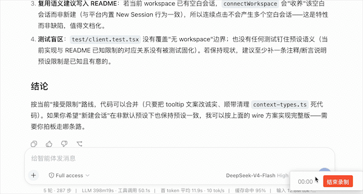

# dsh-compact-button

[简体中文](./README.md) | **English**

<!-- Hero -->
<div align="center">
  <b style="font-size: 1.15em;">Context almost full? One click to compact the early conversation into a summary</b><br /><br />
  <a href="https://www.npmjs.com/package/dsh-compact-button"></a>
  <a href="https://github.com/shyuan-hub/dsh-compact-button/stargazers"></a>
  <a href="https://opensource.org/licenses/MIT"></a>
  <a href="https://www.npmjs.com/package/@deepseek-ai/dsh?activeTab=versions"></a><br /><br />
     <br /><br />
  Two buttons inside the <b>context meter panel</b> of DSH Web: <b>Compact context</b> submits <code>/compact</code> to the current session,<br />
  folding older history into a summary; <b>New session</b> starts a fresh session in the <b>same workspace</b>.<br />
</div>

<div align="center">
  
  <br />
  <i>The context ring next to the composer expands into the context meter panel — the buttons live inside it</i>
  <br /><br />
  
  <br />
  <i>Demo: click Compact context to submit /compact, click New session to start a new session in the same workspace</i>
</div>

## 📑 Contents

- [✨ Features](#-features)
- [🚀 Install](#-install)
- [🖱️ Using the buttons](#️-using-the-buttons)
- [🔧 How it works](#-how-it-works)
- [🛠️ Development & build](#️-development--build)
- [⚠️ Known limitations](#️-known-limitations)

## ✨ Features

- **🔘 One-click compaction**: long conversations keep eating the context window, and you used to type `/compact` by hand — now the button sits on the context panel you already look at. See it filling up, click once.
- **🔁 The exact same command channel**: it goes through the **same channel as typing `/compact`** (`session.command('/compact')`). The result shows up in the conversation stream as a command line, with no special-cased behaviour.
- **📊 Live status feedback**: the button label follows the submission state (idle → submitting → submitted / not matched / failed), then resets after 4 seconds so the panel stays clean.
- **🌏 Multilingual**: follows the DSH language setting, switching between Chinese and English live.
- **🆕 New session**: a second button to the right of the compact button — clicking it starts a new session in the **same workspace** and navigates there. The agent preset and permission settings follow the deployment defaults (see Known limitations for when that matches your current session).
- **🪶 Zero intrusion**: a pure client-half plugin (the host half is an empty `apply`). When the slot is absent the buttons simply do not render, and nothing else on the platform is affected.

## 🚀 Install

**Prerequisites**: DSH installed (`dsh web` runs normally), Node.js ≥ 20, pnpm ≥ 10.

**Option 1: from npm (recommended)**

```sh
dsh plugin --profile web add dsh-compact-button@latest
```

<details>
<summary><b>Option 2: from source (when debugging local changes)</b></summary>

```sh
# 1. Build and pack
git clone https://github.com/shyuan-hub/dsh-compact-button.git && cd dsh-compact-button
pnpm install && pnpm build
pnpm pack                                # produces dsh-compact-button-<version>.tgz

# 2. Install it through dsh plugin (file: channel)
dsh plugin --profile web add "file:<your-local-dir>/dsh-compact-button-<version>.tgz"
```

</details>

After installing, **restart `dsh web`** and hard-refresh the browser (Cmd/Ctrl+Shift+R).

> ✅ No need to edit the profile's `package.json` by hand: this package declares `dsh.bundle.patch`, so `dsh plugin add` appends it to `dsh.profile.bundles` automatically.
>
> 🔧 When debugging local changes you can use the link channel instead: `dsh plugin --profile web add "link:<absolute path to the clone>"`. After that, each `pnpm build` + `dsh web` restart is enough.
>
> 🔄 Updating: `dsh plugin --profile web add dsh-compact-button@latest`, then restart `dsh web` and hard-refresh.

> 📦 The plugin ships its own bundle patch ([`cordis.patch.yml`](./cordis.patch.yml)): once installed into a profile it inserts this plugin's mount entry at startup, so you never edit the profile's `cordis.patch.yml` yourself. If the aggregate bundle already mounts this plugin, the entry steps aside to avoid a double mount.

<details>
<summary><b>Troubleshooting</b></summary>

| Symptom | Cause and fix |
|---|---|
| **No buttons** in the panel | The buttons depend on the `conversation.context.actions` sub-slot, which upstream DSH does not declare — it is injected by a **platform patch this plugin applies automatically** (self-healing on every `dsh web` start, host half). Check the dsh startup log: `[dsh-compact-button] platform patch applied: ... @<version>` means it was injected; `platform patch skipped ... "<anchor>" matched N time(s)` means the upstream ContextMeter changed too much, so the patch aborted safely without touching platform files. The buttons do not render; the rest of the plugin is unaffected. |
| Clicking shows **Command not matched** | The current composer has no session that can accept a command. Switch to a page with an active session and try again. |
| Install / changes did not take effect | This plugin needs a **`dsh web` restart** (a browser hard-refresh alone is not enough). Restart, then hard-refresh the page. |

</details>

> 🔩 **Platform patch (applied automatically)**: the official `@deepseek-ai/dsh-client-ui-conversation` does not declare the `conversation.context.actions` slot. This plugin ships a patch script ([`patch-context-meter.cjs`](./patch-context-meter.cjs)) that, on **every `dsh web` start** (host half), locates the installed platform bundle and injects the slot declaration and its render call in place. The patch is idempotent and asserts every anchor; on an abnormal match it aborts safely (platform files untouched), the buttons do not render, and the rest of the plugin keeps working. The package contains **no install scripts** (nothing depends on postinstall, so no package manager can error out or block it). To patch ahead of a start, run `node node_modules/dsh-compact-button/patch-run.cjs` manually.

> 🔗 **Not tied to DSH releases**: this package declares **no DSH peer dependencies**, and the patch anchors are **format-agnostic semantic regexes** (indentation, quoting, `var/let/const`, the css-module hash and jsx helper renames all still match). So when DSH ships a new version you **do not need to bump this plugin's version or dependency ranges** — as long as the ContextMeter structure is unchanged it adapts on its own; if the structure really changes you just get "buttons not rendered + one clear log line", never a polluted platform file. The startup log prints the detected platform version, and versions that were not exercised get an extra `(not in the tested set)` note. Verified: `0.1.2-rc.1`, `0.1.5-rc.1`, `0.1.5-rc.2`, `0.1.5-rc.3`, `0.1.7-alpha.2`.

## 🖱️ Using the buttons

The panel holds **two** buttons side by side in one row: **Compact context** on the left, **New session** on the right (the context ring next to the composer — click to expand).

### Compact context (left)

The label changes with the click state:

| State | English | Meaning |
| --- | --- | --- |
| Idle | Compact context | Clickable; clicking submits `/compact` |
| Submitting | Compacting… | The command is being sent to the session |
| Submitted | Compaction submitted | The command was accepted; see the conversation stream for the result |
| Not matched | Command not matched | The current composer has no session that can accept a command |
| Failed | Submission failed | An error occurred while submitting the command |

The status resets to **Idle** after 4 seconds.

### New session (right)

Clicking starts a new session in the **workspace of the current session** and navigates to it (`uiWorkspace.startSession()`). The button locks for about 1.5 seconds after a click to prevent accidental double-clicks. The new session uses the deployment's default agent preset and permission settings — if your current session uses a non-default preset, the new session will not inherit it (see Known limitations).

## 🔧 How it works

- **Platform extension point**: the ContextMeter panel of `@deepseek-ai/dsh-client-ui-conversation` declares the sub-slot `conversation.context.actions` (a child of `conversation.composer.bar`, kind: list).
- **Client half**: using `slots.inject`, once the platform declares the slot it registers a side-by-side container (`ContextActionRow`) into it — `CompactButton` on the left, `NewSessionButton` on the right:
  - `CompactButton` calls `session.command('/compact')` on click — the exact same channel as typing `/compact` (acceptance semantics belong to the host's command-compact plugin; the compaction result appears in the conversation stream as a command line).
  - `NewSessionButton` calls `uiWorkspace.startSession()` on click — starts a new session in the current session's workspace and navigates there; it locks for about 1.5 seconds afterwards to prevent accidental double-clicks.
- **Host half**: applies the platform patch self-healing at startup (injecting the `conversation.context.actions` slot declaration into the installed `dsh-client-ui-conversation` bundle). The patch is idempotent, aborts on drift, and never blocks dsh from starting.
- **i18n**: dictionaries are registered under the `compactButton` namespace (zh/en) and follow the DSH language setting live.

### Build artifacts

| File | Channel |
| --- | --- |
| `lib/index.js` | Host half (self-healing platform patch at startup, injects the `conversation.context.actions` slot) |
| `lib/client.js` | Official profile channel (bundle id = package name `dsh-compact-button`) |
| `lib/client-registry.js` | Plugin registry channel (bundle id = manifest id `dsh-external/dsh-compact-button`) |
| `patch-context-meter.cjs` / `patch-run.cjs` | Platform patch module and manual CLI entry (after install the patch is applied automatically by the host half on each `dsh web` start; no install script needed) |

## 🛠️ Development & build

```sh
pnpm install
pnpm typecheck    # tsc --noEmit
pnpm build        # rm -rf lib && tsdown → lib/index.js + lib/client.js + lib/client-registry.js
pnpm watch        # tsdown --watch
```

**Architecture**: a single npm package with a host/client split — the host (`src/index.ts`) is an empty `apply`; the client (`src/client/index.tsx`) registers `CompactButton` into the slot and handles state transitions and i18n. The plugin follows the official DSH conventions (no default export, two client bundles) and depends on neither npm nor a checkout at runtime (`@deepseek-ai/*` is provided by the web profile).

### Version compatibility strategy (why you never touch code when DSH ships)

1. **No DSH peer dependencies.** The plugin imports nothing from the platform at runtime (the client bundle only `require("react")`, the host half only `node:*`); every service arrives through cordis injection. So `package.json` carries no `@deepseek-ai/dsh-*` peer/dev version lock — and no package manager ever pulls a second copy of the renderer just to satisfy a range (two slot registries would break slot registration outright).
2. **The patch anchors are semantic regexes, not source literals.** Every anchor in `patch-context-meter.cjs` tolerates indentation, quoting, `var/let/const`, the css-module hash (the prefix is captured live from the `bar` entry, never hardcoded) and jsx helper renames; the unit suite regresses each of these via `DRIFT_TRANSFORMS`.
3. **Assert + degrade instead of gating on a version number.** Each anchor must still match exactly once, otherwise nothing is written at all. Compatibility is decided by structure, not by a semver range.
4. **`TESTED_PLATFORMS` is documentation only.** It drives the `(not in the tested set)` hint in the startup log and never gates the patch. When DSH ships a new version, change nothing: start it once and read the log. Optionally append the new version number to `TESTED_PLATFORMS` once you have confirmed it.

Verifying a new DSH version (no code change required):

```sh
node -e "const p=require('./patch-context-meter.cjs'),fs=require('fs');console.log(p.patchSource(fs.readFileSync('<path>/lib/client.js','utf8')).status)"
# expect `patched`; `drift` tells you which anchor matched how many times
```

## ⚠️ Known limitations

- Depends on the `conversation.context.actions` sub-slot: the upstream platform does not declare it, so the plugin's automatic platform patch injects it. The anchors are format-agnostic semantic regexes, so the patch only fails when **the upstream ContextMeter structure changes materially** (safe abort, platform files untouched, buttons not rendered).
- The patch only targets `lib/client.js` of `@deepseek-ai/dsh-client-ui-conversation`: if upstream splits or renames that bundle, `findTargetFiles` will not find a target and needs to be updated.
- The compact button only submits `/compact`; acceptance and execution semantics belong to the host-side command-compact plugin.
- The status message resets after 4 seconds; there is no compaction progress display.
- The new-session button starts a session in the same workspace but **uses the deployment's default agent preset and permission settings**. If the current session uses a non-default preset, the new session will not inherit it (the client-side `uiWorkspace.startSession` exposes no preset / permission selection).

---

<div align="center">
  <sub>MIT License · Built for the <a href="https://github.com/deepseek-ai/deepseek-harness">DeepSeek Harness</a> ecosystem</sub>
</div>
