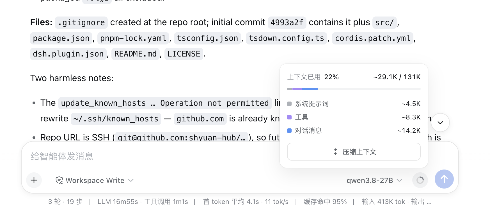

# dsh-compact-button

<!-- Hero -->
<div align="center">
  <b style="font-size: 1.15em;">上下文快满了？点一下，把早期对话压缩成摘要</b><br /><br />
  <a href="https://www.npmjs.com/package/dsh-compact-button"></a>
  <a href="https://github.com/shyuan-hub/dsh-compact-button/stargazers"></a>
  <a href="https://opensource.org/licenses/MIT"></a>
  <a href="https://www.npmjs.com/package/@deepseek-ai/dsh?activeTab=versions"></a><br /><br />
     <br /><br />
  在 DSH Web 的<b>上下文计量面板</b>里放两个按钮：「压缩上下文」点击即向当前会话提交 <code>/compact</code>，<br />
  把较早的对话历史压缩成摘要；「新建会话」点击即在<b>同一 workspace</b> 中开启一个新会话。<br />
  <i>English: a one-click <b>Compact context</b> button and a <b>New session</b> button for the DSH Web context meter panel.</i>
</div>

<div align="center">
  
  <br />
  <i>输入框（composer）旁的上下文圆环展开后就是「上下文计量面板」，按钮就在里面</i>
</div>

## 📑 目录

- [✨ 功能一览](#-功能一览)
- [🚀 安装](#-安装)
- [🖱️ 按钮怎么用](#️-按钮怎么用)
- [🔧 工作原理](#-工作原理)
- [🛠️ 开发与构建](#️-开发与构建)
- [⚠️ 已知限制](#️-已知限制)

## ✨ 功能一览

- **🔘 一键压缩**：长对话不断吃掉上下文窗口，以前得手动敲 `/compact`——现在按钮就放在你随时能看到的上下文面板上，一眼看到快满了，点一下即可
- **🔁 同一条命令通道**：和手敲 `/compact` 走的是**完全相同的通道**（`session.command('/compact')`），压缩结果照常以命令行形式出现在对话流里，无特殊行为
- **📊 状态实时反馈**：按钮文案随提交状态流转（待命 → 提交中 → 已提交 / 未匹配 / 失败），4 秒后自动回到待命，面板保持清爽
- **🌏 多语言**：跟随 DSH 的语言设置，中文 / 英文实时切换
- **🆕 新建会话**：在压缩按钮右侧再放一个「新建会话」按钮——点击即在**同一 workspace** 中开启一个新会话并跳转过去；agent 预设与权限设置沿用部署默认（与当前会话一致的前提见「已知限制」）
- **🪶 零侵入**：纯 client 半边插件（host 半为空 apply）；槽位不存在时按钮安静地不渲染，不影响平台其余部分

## 🚀 安装

**前置**：已装好 DSH（`dsh web` 能正常运行），Node.js ≥ 20、pnpm ≥ 10。

**方式一：从 npm 安装（推荐）**

```sh
dsh plugin --profile web add dsh-compact-button@latest
```

<details>
<summary><b>方式二：从源码安装（调试本地改动时使用）</b></summary>

```sh
# 1. 构建并打包
git clone https://github.com/shyuan-hub/dsh-compact-button.git && cd dsh-compact-button
pnpm install && pnpm build
pnpm pack                                # 生成 dsh-compact-button-0.2.0.tgz

# 2. 通过 dsh plugin 一键安装（file: 通道）
dsh plugin --profile web add "file:<你的本地目录>/dsh-compact-button-0.2.0.tgz"
```

</details>

装完**重启 `dsh web`**，再硬刷新浏览器（Cmd/Ctrl+Shift+R）即可生效。

> ✅ 无需手动编辑 profile 的 `package.json`：本包声明了 `dsh.bundle.patch`，`dsh plugin add` 安装后会自动把它追加进 `dsh.profile.bundles`。
>
> 🔧 调试本地改动时，可改用 link 通道：`dsh plugin --profile web add "link:<克隆目录绝对路径>"`，之后每次 `pnpm build` + 重启 `dsh web` 即可生效。
>
> 🔄 更新：`dsh plugin --profile web add dsh-compact-button@latest`，然后重启 `dsh web` 并硬刷新。

> 📦 插件自带 bundle patch（[`cordis.patch.yml`](./cordis.patch.yml)）：装入 profile 后，启动时会由它自动插入本插件的挂载条目，无需手动编辑 profile 的 `cordis.patch.yml`；若聚合包已挂载本插件，该条目会自动退让，避免重复挂载。

<details>
<summary><b>常见问题</b></summary>

| 现象 | 原因与解决 |
|---|---|
| 面板里**看不到按钮** | 上下文计量面板必须声明 `conversation.context.actions` 子槽位（见下方「平台补丁」）。确认补丁已应用后硬刷新。 |
| 点击后显示「命令未匹配」 | 当前 composer 没有可提交命令的会话。切换到有活跃会话的页面再试。 |
| 安装 / 改动后没生效 | 本插件需要**重启 `dsh web`** 才能生效（仅硬刷新浏览器不够），重启后再硬刷新页面。 |

</details>

> 🔩 **依赖平台补丁**：上下文计量面板的 `conversation.context.actions` 子槽位由平台补丁声明（随附的平台补丁已应用）。若该槽位不存在，按钮不会渲染，插件其余部分不受影响。

## 🖱️ 按钮怎么用

面板里有**两个**按钮，并排在同一行：左侧「压缩上下文」、右侧「新建会话」（composer 旁的上下文圆环，点击展开）。

### 压缩上下文（左侧）

文案会随点击状态变化：

| 状态 | 中文 | English | 含义 |
| --- | --- | --- | --- |
| 待命 | 压缩上下文 | Compact context | 可点击，点击即提交 `/compact` |
| 提交中 | 压缩中… | Compacting… | 正在向会话提交命令 |
| 已提交 | 已提交压缩 | Compaction submitted | 命令已被接纳，压缩结果见对话流 |
| 未匹配 | 命令未匹配 | Command not matched | 当前 composer 没有可提交命令的会话 |
| 失败 | 提交失败 | Submission failed | 提交命令时出错 |

状态会在 4 秒后自动回到「待命」。

### 新建会话（右侧）

点击即在**当前会话所在的 workspace** 中开启一个新会话并跳转过去（`workspaces.startSession()`）。点击后会短暂锁定约 1.5 秒，防止误连点。新会话沿用部署默认的 agent 预设与权限设置——若当前会话用的是非默认预设，新会话不会自动沿用（见「已知限制」）。

## 🔧 工作原理

- **平台扩展点**：`@deepseek-ai/dsh-client-ui-conversation` 的 ContextMeter 面板声明子槽位 `conversation.context.actions`（`conversation.composer.bar` 的 children，kind: list）。
- **client 半边**：通过 `slots.inject` 等待平台声明后，把一个并排容器（`ContextActionRow`）注册进该槽位，容器内左为 `CompactButton`、右为 `NewSessionButton`：
  - `CompactButton` 点击调用 `session.command('/compact')`——与手敲 `/compact` 完全同一条通道（接纳语义由 Host 的 command-compact 插件拥有，压缩结果以命令行形式出现在对话流中）。
  - `NewSessionButton` 点击调用 `workspaces.startSession()`——在当前会话所在 workspace 中开启新会话并跳转；点击后约 1.5 秒内锁定防止误连点。
- **Host 半边**：空 `apply`，无宿主行为。
- **i18n**：字典注册在 `compactButton` 命名空间（zh/en），跟随 DSH 语言设置实时切换。

### 构建产物 / Artifacts

| 文件 | 通道 |
| --- | --- |
| `lib/index.js` | Host 半边（空 apply，无宿主行为） |
| `lib/client.js` | 官方 profile 通道（bundle id = 包名 `dsh-compact-button`） |
| `lib/client-registry.js` | 插件注册表通道（bundle id = manifest id `dsh-external/dsh-compact-button`） |

## 🛠️ 开发与构建

```sh
pnpm install
pnpm typecheck    # tsc --noEmit
pnpm build        # rm -rf lib && tsdown → lib/index.js + lib/client.js + lib/client-registry.js
pnpm watch        # tsdown --watch
```

**架构**：单 npm 包、host/client 双半结构——host（`src/index.ts`）为空 apply；client（`src/client/index.tsx`）注册 `CompactButton` 到槽位并处理状态流转与 i18n。插件按 DSH 官方规范组织（无 default 导出、双 client bundle），运行期不依赖 npm / checkout（`@deepseek-ai/*` 由 web profile 提供）。

## ⚠️ 已知限制

- 依赖平台为上下文计量面板声明 `conversation.context.actions` 子槽位（需随附补丁）；槽位缺失时按钮不渲染
- 压缩按钮只负责提交 `/compact`，压缩的接纳与执行语义由 Host 侧 command-compact 插件拥有
- 状态提示 4 秒后自动复位，不提供压缩进度展示
- 新建会话按钮在同一 workspace 中开启新会话，但**沿用部署默认的 agent 预设与权限设置**；若当前会话用的是非默认预设，新会话不会自动沿用（client 侧 `session.create` 不暴露预设/权限选择）

---

<div align="center">
  <sub>MIT License · Built for the <a href="https://github.com/deepseek-ai/deepseek-harness">DeepSeek Harness</a> ecosystem</sub>
</div>
